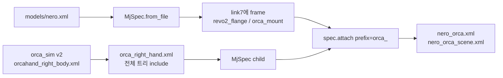

# Nero + Orca 손목 attach 보고서

- 날짜: 2026-09-15
- 범위: 공식 Orca v2 오른손(전완 타워 + 손목 관절 + 손가락)을 Nero `link7`에 붙인 단일 MuJoCo 로봇. 웹캠 `SimSink`·IK는 포함하지 않음
- 선행: [nero-standalone-sim-report.md](nero-standalone-sim-report.md)
- 저장소: [Jowonji/nero_orca](https://github.com/Jowonji/nero_orca) (private)
- 손 모델: 형제 클론 `../orca_sim` (`orcahand/orca_sim` v2 MJCF). 공식 패키지는 수정하지 않음
- 시뮬 환경: conda `orca`, MuJoCo **3.12.0**, WSL2 (`DISPLAY=:0`, GL은 Mesa `llvmpipe`)

## 1. 목적

Nero 7축과 Orca 손이 **같은 `MjModel` / `MjData`** 안에 있고, 팔이 움직이면 손 전체가 따라오게 만드는 것이다. 그리퍼 xacro를 쓰지 않고, 손을 URDF로 합치지도 않는다.

실물에서는 전완 타워가 손과 한 덩어리로 팔 끝에 붙어 있다. 그래서 시뮬도 공식 트리 그대로 붙인다. carpal(손바닥)만 용접하면 연결 상태가 실물과 다르다.

하지 않은 것:

- Nero `nero_with_gripper_*.xacro`, Revo2 손 xacro를 자식으로 넣지 않음. Revo2는 **마운트 숫자만** 참고
- `scene_right.xml` 전체를 include하지 않음. 바닥이 있는 손 씬을 두 번째 로봇으로 두지 않음
- Orca STL을 미터로 재변환하지 않음. 공식 `mesh scale="0.001"` (mm)를 유지
- `orcahand_description` / `orca_core`는 손대지 않음

## 2. 왜 URDF 머지가 아닌가

Nero는 ROS URDF, Orca v2는 이미 MJCF이다. 손 collision/visual STL은 밀리미터이고 MuJoCo 기본값은 미터다. URDF로 합치면 스케일이 깨진다.

공식 Orca 씬은 이렇게 손을 올린다.

```xml
<body name="right_mount" pos="..." euler="1.5708 0 0">
  <include file="orcahand_right_body.xml"/>
</body>
```

팔에 붙일 때는 scene include가 아니라 MuJoCo 3.12 `MjSpec.attach(child, prefix=..., frame=...)` 로 손 서브트리를 `link7` 프레임의 자식으로 넣는다. 컴파일 후 `orca_right_tower` parent는 `link7`이다.

## 3. 연결 파이프라인

`attach_orca.py`가 `models/nero.xml`을 읽고 손을 붙인 뒤 `models/nero_orca.xml`을 쓴다.



단계:

1. `options.xml` + `orcahand_right.mjcf`(메시·액추에이터·contact) + 공식 `orcahand_right_body.xml` worldbody를 `models/orca_right_hand.xml`에 씀. 바닥 없음
2. parent `link7`에 프레임 두 개: AgileX Revo2 플랜지, 그 위에 손 base
3. `parent.attach(child, prefix="orca_", frame=orca_mount)` — 루트는 `right_tower`
4. `link5`/`link6`/`link7` vs ForeArm / TopTower / carpals `<exclude>`
5. 합친 모델의 Nero position actuator를 `kp=400` `kv=40` 으로 올림 (손+타워 질량)
6. `spec.compile()` 후 `to_file`. Orca 메시 절대경로를 `../../orca_sim/...` 로 되돌림

재생성:

```bash
conda activate orca
cd /home/keti/workspace/nero_orca
python attach_orca.py
python view_combined.py --check
python view_combined.py
```

`orca_sim` / `agx_arm_urdf`가 워크스페이스 형제로 있어야 메시가 열린다.

## 4. 기구학적으로 무엇이 붙는가

공식 Orca v2 트리 그대로:

```
link7
  orca_right_tower
    orca_right_ForeArmStructure     ← 전완 하우징 (실물과 같이 유지)
      orca_right_TopTower
        orca_right_R-Carpals        ← 손바닥. right_wrist 관절이 여기
          엄지 / 검지 / 중지 / 약지 / 소지
```

`right_wrist`는 TopTower와 carpals 사이 1축이다. 제거하지 않는다. 손목 굽힘은 `orca_right_wrist_actuator`이고, Nero `joint7`은 팔 끝 롤이다. 둘을 같은 명령으로 겹쳐 쓰지 않는다.

컴파일러가 프레임을 베이크해서 tower는 `pos="0.043 0 -0.0235"` `quat="0 0.707107 0.707107 0"` 로 `link7`에 붙는다. `0.043`은 플랜지 x `0.031`과 손 z `0.012`가 합성된 값이다.

홈 자세에서 손바닥은 타워에서 약 `+Z` 14 cm (월드), 중지 끝은 약 23 cm. 손가락이 팔 축 원위로 나가고, 손바닥은 joint4가 더 접히는 쪽(월드 `-X`)을 향한다.

## 5. 마운트 pose

숫자는 AgileX `nero_with_revo2_flange_description.xacro` + `hand_base_joint`에서 가져왔다. URDF `rpy`에 맞춰 `compiler.eulerseq = "XYZ"`.

공식 손 MJCF에서 타워 +Y가 손 길이 방향이다. Revo2 플랜지 +Z가 툴 축이므로, 손에는 추가로 `+π/2` X 회전을 넣는다. 공식 테이블 씬의 `euler="1.5708 0 0"`과 같은 이유다.

Z는 `+π/2`다. `π`면 손바닥이 joint4 힌지 축(홈에서 ±Y)을 보고, 손가락이 접힘 평면 안에 펼쳐진다. Nero `joint4`는 양수 쪽이 더 많이 접히고, 홈에서 원위 링크가 월드 `-X`로 간다. 손바닥이 그 안쪽을 향하고, 너클이 힌지(Y)와 나란해야 한다.

| 프레임 | pos (m) | euler XYZ (rad) |
|---|---|---|
| `revo2_flange` on `link7` | `0.031, 0, -0.0235` | `-π/2, 0, -π/2` |
| `orca_mount` on flange | `0, 0, 0.012` | `π/2, 0, π/2` |

시작값이며 `attach_orca.py`의 `FLANGE_*` / `HAND_*`로 튜닝한다.

## 6. 액추에이터와 한도

한 모델 `nu=24`. 이름은 `orca_` prefix.

| 구분 | 개수 | 이름 |
|---|---|---|
| Nero | 7 | `nero_joint1_act` … `nero_joint7_act` |
| Orca 손목 | 1 | `orca_right_wrist_actuator` |
| Orca 손가락 | 16 | `orca_right_{p,r,m,i}-abd/mcp/pip_actuator`, `orca_right_t-cmc/abd/mcp/pip_actuator` |

저장된 순서(현재 XML): Nero 7개, 그다음 `wrist`, 그다음 소지→엄지. **제어는 인덱스가 아니라 `mj_name2id`.** 데이터 스키마로 concat할 때는 `7 + 17 = 24`.

합친 모델 Nero gain: `kp=400` `kv=40` (`gainprm`/`biasprm`). 단독 `nero.xml`은 그대로 `100`/`10`. 토크 한도는 MIT와 같이 24/16/8 N·m (`forcerange`). 속도 한도 `5 rad/s`는 `limits.step_nero()`의 slew + `qvel` clip. 손가락·손목은 `step_nero`가 이름을 모르므로 `data.ctrl`을 유지한다.

`--check`: tower parent가 `link7`, carpals parent가 TopTower, `right_wrist_actuator` 존재, 공식 rest 자세 홀드 중 `orca_right_i-mcp_actuator=0.8`이면 손가락만 따라감.

## 7. Orca 손목과 Nero joint7

공식 모델의 `right_wrist`는 전완과 손바닥 사이 1축이다. `orca_core` `joint_ids` 첫 항목도 `wrist`다. 합친 모델에도 그대로 있다.

웹캠 리타겟은 이 축을 거의 안 쓴다.

- 리타겟터: wrist는 최적화가 아니라 passthrough
- MediaPipe 기본 `wrist_angle_degrees = 0`
- Quest만 `--quest-wrist`
- SimSink `go_home`도 `wrist = 0`

그래서 공식 손 시뮬에서 슬라이더로는 손목이 움직이지만, 웹캠 파이프라인은 손가락만 움직이고 손목은 0에 붙어 있었다. 합친 모델에서도 웹캠은 손가락 16축만 넣고, `right_wrist`는 0 홀드가 기본이다. 사람 손목 포즈는 나중에 EE IK / Nero 7축으로 보낸다. `right_wrist`와 `nero_joint7`에 같은 굽힘을 동시에 넣지 않는다.

## 8. 트러블슈팅

### 8.1 손이 옆으로 나옴 (첫 attach)

타워를 `link7`에 붙이되 마운트 euler가 Revo2 손(`0 0 π`)만이면, 공식 손의 손 길이 축(+Y)이 툴 축(+Z)과 안 맞는다. 전완 박스는 팔 끝에 있고 손가락이 옆으로 나간다. 해결은 타워를 빼는 게 아니라 `HAND_EULER = (π/2, 0, π/2)` 로 손을 원위에 두고, 손바닥을 joint4 안쪽으로 맞추는 것이다.

### 8.2 carpal만 붙이면 실물과 다름

실물 로봇은 tower / ForeArm이 손과 같이 팔 끝에 고정된다. carpal만 용접하고 `right_wrist`를 지우면 질량·충돌·연결 형상이 달라진다. 같은 spec 안에서 `attach_body(carpals)`는 `incompatible id in body array`로 실패한다. 공식 `orcahand_right_body.xml` 전체를 child worldbody로 include하는 방식이 동작한다.

### 8.3 URDF로 손을 합치면 스케일이 깨짐

Orca 기본 `<mesh scale="0.001 0.001 0.001"/>`. Nero collision STL은 미터. attach 후 손 메시는 `scale="0.001"`이 유지되어야 한다.

### 8.4 손 무게로 팔이 처짐

단독 `kp=100`이면 `joint6`가 중력에 처진다. 합친 모델은 `400`/`40`이되 `forcerange`는 MIT 한도(24/16/8)다. 공식 rest(`joint4=1.22`)는 2·4번에 약 7 N·m라 16 N·m 한도 안이다. 2번을 ±90°로 수평 신장하면 약 20 N·m라 한도에 가깝고, 예전 `±100`일 때처럼 아무 자세나 버티지 않는다.

### 8.5 뷰어 창이 안 보임 / 프레임이 안 나옴

프로세스 자체는 살아 있고 X11 창 `MuJoCo : nero_orca_view`도 생성된다. WSL `llvmpipe`(GPU 가속 없음)에서:

- 기본 `shadowsize=4096` 그림자 맵
- `launch_passive`가 매 물리 스텝 `vis.sync()` (timestep 0.002 s)
- 합친 손 메시 `nmesh≈61`

CPU가 300%대로 치솟고 Cursor 뒤에 창이 가려지거나 첫 프레임이 안 그려진다. Nero 단독은 가벼워서 같은 루프로도 됐다.

조치: `view_combined.py`는 화면을 **15 fps**로만 `sync`하고, 시작 때 Shadow/Reflection 플래그만 끈다. `shadowsize=0`으로 맵을 없애면 뷰어에서 Shadow를 켜도 그림자가 안 나온다. 맵은 기본값으로 두고 플래그만 끈다. 창이 안 보이면 Alt+Tab.

### 8.6 Control 슬라이더가 0으로 돌아감

초기 데모가 매 프레임 `ARM_HOLD=0`과 MCP 사인파로 `data.ctrl`을 덮어썼다. 지금은 `step_nero(model, data)`만 호출해서 슬라이더 값이 유지된다. 팔 slew/`qvel` clip은 Nero 이름만 해당한다.

### 8.7 `to_file`이 compile 전에 실패

`MjSpec.to_file`은 컴파일된 spec만 쓴다. `spec.compile()` 다음 `to_file`. timestep이 XML에서 빠지면 `implicitfast` 줄에 `timestep="0.002"`를 다시 넣는다.

## 9. 산출물

| 경로 | 역할 |
|---|---|
| `attach_orca.py` | 공식 손 트리 `MjSpec.attach`, 한도/exclude |
| `view_combined.py` | 뷰어 (Control 슬라이더) / `--check` |
| `models/orca_right_hand.xml` | 바닥 없는 손 래퍼 (생성됨, 타워 포함) |
| `models/nero_orca.xml` | 합친 MJCF |
| `models/nero_orca_scene.xml` | 바닥·조명. 시작 시 그림자는 뷰어 플래그로만 off |

제어 예:

```python
from limits import step_nero

step_nero(model, data, {"nero_joint2_act": -0.4})
aid = mujoco.mj_name2id(model, mujoco.mjtObj.mjOBJ_ACTUATOR, "orca_right_i-mcp_actuator")
data.ctrl[aid] = 0.8
step_nero(model, data, {"nero_joint2_act": -0.4})
```

## 10. 남은 것

예정 제어 구조 (아직 미구현):

```
MediaPipe landmarks → 기존 Retargeter → orca_q (16 손가락; wrist는 0 홀드)
사람 wrist/palm  → 좌표 변환 → EE → Nero IK → nero_q (7)
이름로 data.ctrl에 기록 후 한 번 mj_step
스키마용 action = concat([nero_q, orca_q])   # 24 if wrist included, else 23+wrist=0
```

| 상태 | 항목 |
|---|---|
| 완료 | 공식 tower+손목+손가락을 `link7`에 attach, 이름 액추에이터 24개 |
| 완료 | 뷰어 Control로 팔·손 조작 (덮어쓰기 제거, 15 fps, 그림자 기본 off) |
| 완료 | 합친 SimSink: 팔 rest 홀드 + 손가락 리타겟, 스키마 24 (Nero 7 + Orca 17, wrist=0) |
| 미완 | 마운트 pose·`joint6` 처짐 튜닝 |
| 미완 | 웹캠 wrist → EE 변환 + IK |
| 미완 | 실기: 같은 스키마로 팔 CAN + 손 USB 한 루프 |

수집:

```bash
cd /home/keti/workspace/nero_orca
python sim_sink.py --check

export ORCAHAND_DESCRIPTION_DIR=/home/keti/workspace/orcahand_description
python record_dataset.py --local --source mediapipe --show-video --overwrite --fps 15 \
  --episode-end space --num-episodes 5 \
  --urdf-path "$ORCAHAND_DESCRIPTION_DIR/v1/models/urdf/orcahand_right.urdf" \
  --task "wave and flex fingers, arm at rest"
```

`observation.state` / `action` 이름은 `nero_joint1`…`nero_joint7` 다음 orca_core `wrist`, `thumb_cmc`, … `pinky_pip`. 팔 명령은 rest `[0,0,0,1.22,0,0,1.31]` (도), 손은 리타겟 각도(도).
