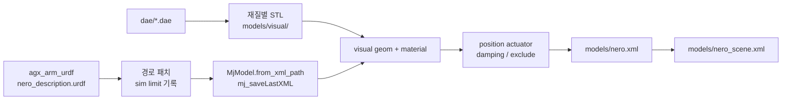

# Nero 단독 모델 MuJoCo 적재 보고서

- 날짜: 2026-09-15
- 범위: AgileX Nero 7축 팔만. Orca 손 attach·웹캠 리타겟은 포함하지 않음
- 저장소: [Jowonji/nero_orca](https://github.com/Jowonji/nero_orca) (private)
- 공식 팔 URDF: 워크스페이스 형제 클론 `../agx_arm_urdf` (`agilexrobotics/agx_arm_urdf`)
- 시뮬 환경: conda `orca`, MuJoCo **3.12.0**, WSL2 (`DISPLAY=:0`)

## 1. 목적

최종 목표는 Nero 팔 + Orca 손을 **하나의 MuJoCo 로봇**으로 만들고, 웹캠은 손가락 actuator만, 팔은 별도 명령으로 제어하는 것이다.

그 전에 확인해야 할 것은 팔 단독이 시뮬레이터에서 안정적으로 서고, 이름 기준 position 제어가 되며, 공식 형상·한도가 보존되는 것이다. 본 보고서는 그 1단계 결과와, 적재 과정에서 막힌 지점을 정리한다.

하지 않은 것:

- Nero 공식 그리퍼 / Revo2 xacro를 쓰지 않음. 손은 나중에 `link7` 자식으로 attach
- `agx_arm_urdf`에 변환 결과를 커밋하지 않음
- Orca 공식 패키지를 Nero 변환에 섞지 않음

## 2. 환경에서 바로 막힌 것

워크스페이스 기본 Python 3.14에는 `mujoco`가 없다. Orca 웹캠 파이프라인과 같은 conda 환경 `orca`를 써야 한다.

```bash
conda activate orca
python -c "import mujoco; print(mujoco.__version__)"   # 3.12.0
```

공식 모델은 ROS URDF이다. `MjModel.from_xml_path("nero_description.urdf")`는 그대로는 실패한다.

| 원인 | 증상 |
|---|---|
| `package://agx_arm_description/...` | 메시 파일을 찾지 못함 |
| visual이 Collada `.dae` | 이 MuJoCo 빌드: `no decoder found for .dae` |
| 기본 `fusestatic` | 고정 조인트 바디가 부모에 합쳐져 **`link7`이 사라짐** |
| 뷰어 | WSL에서 `DISPLAY`가 없으면 창이 안 뜸 |

ROS2 드라이버·CAN은 이 단계에 필요 없다.

## 3. 변환 파이프라인

`prepare_nero.py`가 공식 URDF를 읽고, 생성물을 `models/`에 쓴다. 공식 저장소는 읽기만 한다.



단계:

1. `package://.../meshes/dae/` 와 `package://.../meshes/` 를 `../agx_arm_urdf/nero/meshes` 상대 경로로 바꿈
2. URDF `<limit>`를 시뮬 한도로 교체 (아래 4절)
3. `<compiler discardvisual="false" fusestatic="false" strippath="false"/>` 삽입
4. 컴파일 후 MJCF 저장, mesh 경로를 `meshdir="."` 기준으로 재작성
5. DAE를 diffuse 색으로 나눠 `models/visual/*.stl` 생성, visual geom에 material 부여
6. collision STL은 공식 메시를 그대로 두고 `group="4" rgba="0 0 0 0"` 로 숨김
7. `joint1`–`joint7`에 이름 붙은 `<position>` actuator 추가
8. `damping` / `armature`, 인접 링크 `<exclude>`, `implicitfast` / `timestep=0.002`
9. 바닥·조명 scene 래핑

재생성:

```bash
conda activate orca
cd /home/keti/workspace/nero_orca
python prepare_nero.py
```

## 4. 시뮬 한도

URDF에 적힌 각도는 pyAgxArm/ROS 소프트웨어 클램프를 반올림한 값이다. 시뮬 각도 한도는 **ROS/SDK 한도에서 좌우 1°를 깎은 값**이다. 시뮬에서 허용된 명령은 실기 소프트웨어 클램프 안쪽이다.

속도는 URDF `velocity="5"` rad/s를 그대로 쓴다. MuJoCo position actuator에는 속도 한도가 없으므로 `limits.step_nero()`가 `ctrl`을 `vmax*dt`로 slew하고, step 뒤 `data.qvel`을 clip한다.

| 관절 | ROS/SDK (rad) | 시뮬 (rad) | effort (N·m) | vmax (rad/s) |
|---|---|---|---|---|
| joint1 | ±2.705261 | ±2.68781 | 24 | 5 |
| joint2 | ±1.745330 | ±1.72788 | 24 | 5 |
| joint3 | ±2.757621 | ±2.74017 | 16 | 5 |
| joint4 | −1.012291 … 2.146755 | −0.994838 … 2.1293 | 16 | 5 |
| joint5 | ±2.757621 | ±2.74017 | 8 | 5 |
| joint6 | −0.733039 … 0.959932 | −0.715586 … 0.942479 | 8 | 5 |
| joint7 | ±1.570797 | ±1.55334 | 8 | 5 |

`effort`는 공식 URDF의 `100`이 아니라 pyAgxArm MIT `t_ff` 클램프다 (1–2축 24, 3–4축 16, 5–7축 8). 액추에이터 `forcerange`가 이 값이라 한도를 넘는 자세는 실기처럼 처진다. 공식 대기 자세는 `REST_QPOS = [0, 0, 0, 1.22, 0, 0, 1.31]` (Isaac Lab/텔레옵 init).

액추에이터:

- 이름: `nero_joint1_act` … `nero_joint7_act`
- 종류: `<position gear="1" kp="100" kv="10">`
- `ctrlrange` = 시뮬 각도, `forcerange` = ±effort
- 제어는 인덱스 슬라이스가 아니라 **이름** (`mj_name2id`)

`kp`/`kv`는 hold가 되는 시작값이다. 진동·추종을 보고 나중에 튜닝한다.

## 5. 산출물

| 경로 | 역할 |
|---|---|
| `prepare_nero.py` | 변환 엔트리 |
| `dae_visuals.py` | DAE 재질 분할 → visual STL |
| `limits.py` | ROS/시뮬 한도, `step_nero` / `clip_qvel` |
| `view_nero.py` | 뷰어와 `--check` |
| `models/nero_prepared.urdf` | 경로·한도를 고친 중간 URDF |
| `models/nero.xml` | 팔 MJCF (actuator, damping, exclude, 색) |
| `models/nero_scene.xml` | 바닥·조명 include |
| `models/nero_limits.json` | 한도 스냅샷 |
| `models/visual/*.stl` | 색 있는 visual 메시 |

collision STL은 계속 형제 경로 `../../agx_arm_urdf/nero/meshes/*.stl` 을 가리킨다. `agx_arm_urdf`가 옆에 있어야 로드된다.

Bodies: `world`, `base_link`, `link1`–`link7`. `link7`이 남아 있어야 다음 단계 attach 점이 된다.

## 6. 트러블슈팅

### 6.1 `package://` 경로

공식 URDF는 ROS 패키지 URL을 쓴다. MuJoCo는 그것을 해석하지 않는다. 변환기가 실제 상대 경로로 바꾼다. `mj_saveLastXML`이 절대 경로를 남기면 `meshdir="."` 기준으로 다시 상대 경로화한다.

### 6.2 DAE 디코더 없음

visual은 `.dae`다. 이 빌드는 DAE를 읽지 못한다.

처음에는 같은 이름의 **collision STL**을 visual에도 썼다. 파일은 진짜 STL이지, 확장자만 바꾼 DAE가 아니다. 컴파일은 되지만 STL에 재질이 없어서 **전체가 회색**이었다.

확장자만 `.dae` → `.stl`로 바꾸면 바이너리가 Collada로 남아 로드가 실패한다.

### 6.3 색 복구

`dae_visuals.py`가 각 DAE의 triangle group을 diffuse 색으로 나눠 STL을 쓴다. 관측된 재질은 대략 근흑 플라스틱 (0.008), 은색 밴드 (0.72), 흰 로고, 빨간 액센트다.

collision geom을 그대로 두면 회색이 visual 위에 칠해진다. collision은 `group="4"` + 투명으로 두고, visual만 `group="1"` / `contype="0"` 이다.

### 6.4 `link7`이 사라짐

MuJoCo URDF 컴파일 기본값은 고정 조인트 바디를 부모에 합친다. 손목 플랜지 `link7`이 없어지면 손을 붙일 바디가 없다.

`<compiler fusestatic="false"/>` 로 `base_link`와 `link7`을 남긴다. `prepare_nero.py`는 `link7`이 없으면 실패한다.

`discardvisual="false"` 도 같이 켠다. 끄면 visual geom이 버려진다.

### 6.5 시뮬이 폭발함

URDF 컴파일 직후 관절에 damping이 없고, 맞닿은 링크 collision이 살아 있다. `mj_step`이 한두 프레임 안에 발산한다.

조치:

- 관절 `damping="1"` `armature="0.05"`
- `base_link`–`link1` … `link6`–`link7` `<exclude>`
- `<option integrator="implicitfast" timestep="0.002"/>`

### 6.6 속도 한도가 actuator에 안 들어감

`<position>` 의 `ctrlrange`는 각도다. URDF `velocity="5"` 는 컴파일 결과 actuator에 복사되지 않는다. 큰 목표각을 한 프레임에 넣으면 관절이 한도를 넘긴다.

`limits.step_nero()`가 명령을 `5 rad/s * dt` 로 기울이고, step 후 `qvel`을 ±5로 clip한다. 뷰어 루프도 `clip_qvel`을 호출한다.

### 6.7 그리퍼 프로토타입과의 차이

초기 실험 `agx_arm_urdf/view_nero_mujoco.py`는 그리퍼 xacro를 풀고, inertial 없는 `gripper_link`에 더미 관성을 넣었다. 그 스크립트는 AgileX 저장소에 커밋하지 않았고, 현재 `nero_orca` 경로에도 쓰지 않는다. 그리퍼를 팔에 얹은 채로 Orca를 붙이면 안 된다.

### 6.8 실행 환경

- `conda activate orca` 없이 돌리면 `import mujoco` 실패
- 뷰어는 `DISPLAY=:0` (WSL)
- `view_nero.py`는 `viewer.launch_passive` + 직접 `mj_step` 이다. 그래야 매 스텝 `clip_qvel`을 넣을 수 있다

## 7. 검증

```bash
conda activate orca
cd /home/keti/workspace/nero_orca
python view_nero.py --check
python view_nero.py
```

`--check`는 `models/nero.xml`을 로드하고 다음을 확인한다.

1. `nero_joint1_act` 에 0.2 rad → `qpos`가 0.2 근처 (허용 오차 0.05 rad)
2. `joint1` 시뮬 상한까지 큰 이동 → peak `|qvel|` ≤ 5 rad/s

뷰어는 `models/nero_scene.xml` (바닥 포함)을 연다. 슬라이더로 관절을 움직이면 색 있는 메시가 따라가고, `link7`이 트리에 남아 있으면 된다.

## 8. 제어 사용법

```python
import mujoco
from limits import step_nero

model = mujoco.MjModel.from_xml_path("models/nero.xml")
data = mujoco.MjData(model)
step_nero(model, data, {"nero_joint1_act": 0.2})
```

합친 로봇에서도 같은 규칙을 쓴다. 팔은 `nero_joint*_act`, 손은 Orca actuator 이름. `data.ctrl[0:7]` 같은 슬라이스는 쓰지 않는다.

## 9. 남은 것 / 다음 단계

Nero 단독은 여기까지다. 손 연결은 [nero-orca-attach-report.md](nero-orca-attach-report.md)에 따로 적었다.

| 상태 | 항목 |
|---|---|
| 완료 | 공식 팔 URDF 적재, `link7` 보존, 7개 이름 actuator, 각도·속도 한도, 색 있는 visual |
| 완료 | Orca v2 오른손(타워+손목+손가락)을 `link7`에 `MjSpec.attach` (`models/nero_orca.xml`) |
| 완료 | 팔 고정 + 손가락을 이름(`orca_right_i-mcp_actuator`)으로 구동 |
| 미완 | 손 무게·충돌 튜닝 (joint6가 중력에 ~0.04 rad 처짐, 마운트 pose 미세조정) |
| 미완 | 기존 `SimSink`를 합친 모델의 손 actuator에 연결 |
| 미완 | 데이터셋 스키마 |

남기되 쓰지 말 것:

- `agx_arm_urdf/view_nero_mujoco.py` — 초기 프로토타입
- Nero 그리퍼 xacro, Revo2 부착 xacro — 마운트 숫자 참고용일 뿐
- Orca를 URDF로 합치는 경로 — 손 STL 스케일이 mm (0.001). MJCF attach만 사용
